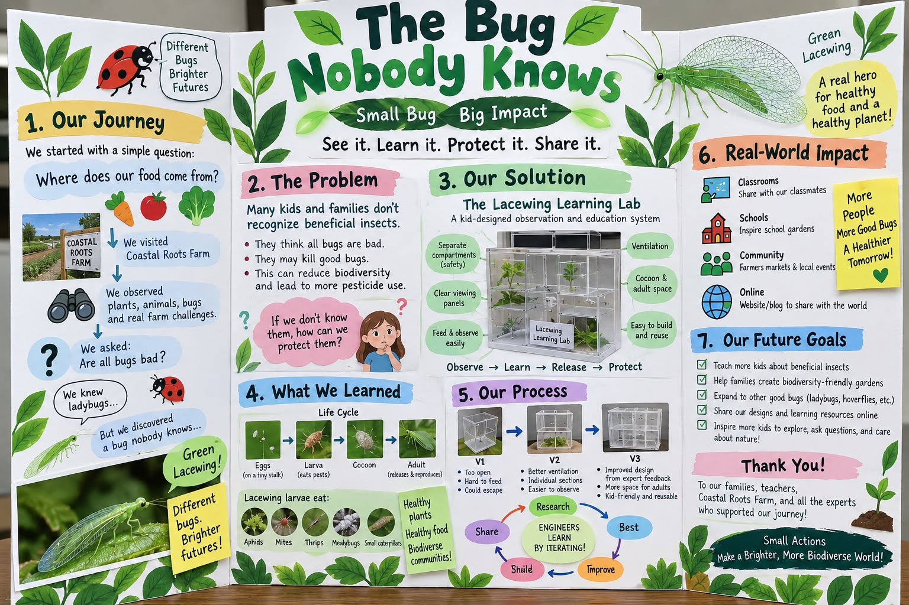

# The Lacewing Project — Innovation Project Working Page

**Summary**: The Innovation Project as it actually stands — the real-world problem, the "Lacewing Learning Lab" solution, what the team is raising at home, what the supplier taught us, the second farm tour, and the experts lined up. Reconstructed from the team WhatsApp thread, 6–18 September.

**Sources**: raw/whatsapp/team-chat-export-2026-09-18.txt (team chat, 6–18 Sep 2026, principally Meiling, Rumi, Chris, Ivy, Jason); Rincon-Vitova order-desk email of 10 Sep 2026 forwarded into the chat; raw/bioglow/fll-future-3-8-judging-rubric.pdf

**Last updated**: 2026-09-20

---

*Where the project could end up — a concept board Meiling shared on 15 September, "just to give us a general picture." Not the team's board; the kids build theirs. Worth reading for the shape: journey → problem → solution → what we learned → process → impact → future goals, with the life cycle and three prototype versions in the middle.*

## The presentation board — sections and owners

Introduced 20 September, following the concept board above. Owners as of Week 9:

| Section | Owner |
|---------|-------|
| 1 · Our Journey | Kyle · Kei |
| 2 · The Problem | Cheryl |
| 3 · Our Solution | Lola |
| 4 · What We Learned | Lindsey |
| 5 · Our Process | *unassigned* |
| 6 · Real-World Impact | *unassigned* |

The two open sections are the evidence sections — Process is V1 → failure → change, Impact is the before/after survey. See [[lacewing-play]] for the same six blanks in script form.

## Status — what is actually happening

| Date | Event | |
|------|-------|:-:|
| **6 Sep** | Kids choose green lacewing. Homework set | ✅ |
| **7 Sep** | Meiling identifies the design gap and the expert list | ✅ |
| **10 Sep** | Rincon-Vitova replies with rearing advice — see below | ✅ |
| **13 Sep** | Observation-box materials sent to families — each child designs their own box | ✅ |
| **15 Sep** | Problem redefined after Chris's question. Kids to bring a drawing *or* rough prototype to the farm | ✅ |
| **16 Sep** | Order paid. **Eggs arrive the same day**, with extra food. Ivy feeding whiteflies and moth eggs | ✅ |
| **17 Sep** | *"Two bugs are fighting"* — cannibalism observed first-hand. Meiling separates them. Possible egg spotted | ✅ |
| **19–21 Sep** | **Eggs hatch** — larvae must be separated as they emerge | ⏳ expected |
| **20 Sep** | **Second Coastal Roots Farm tour**, 10:30 AM – 12:00 PM, arrive 10:00. Kids bring box designs | 📅 booked |
| *a Sunday, TBD* | **Zoom with Tracy, Rincon-Vitova** — expert interview | 📅 offered |
| **late Sep** | Larvae growing. **Count aphids eaten** — the measurement that justified choosing lacewings | ⏳ expected |
| **early Oct** | **Cocoons** spun on the cardboard hiding spots | ⏳ expected |
| **early–mid Oct** | **Adults emerge** — full life cycle observed, photographed at every stage | ⏳ expected |
| **mid Oct** | Improved observation boxes (V2) after farm and supplier feedback | ⏳ expected |
| **Oct, TBD** | **Release** at the farm — only if the farm approves | ⏳ expected |
| **1 Nov** | Mock judging — project presentation rehearsed to time | 📅 calendar |
| **15 Nov** | **Tournament** | 📅 calendar |

Expected dates are Meiling's estimate from 7 September. Adults land roughly four weeks before the tournament — tight but workable for a life-cycle story with photos of every stage. Insects do not read calendars; expect the middle rows to slide.

---

## The problem, as the team now defines it

Chris asked the question that sharpened everything: *"kids don't know green lacewings"* is not a real-world problem. Meiling's reframing on 15 September is now the working definition: (source: team-chat-export-2026-09-18.txt, 9/15)

> **Most people — kids and adults — cannot tell a good bug from a bad bug. Because every bug looks like a pest, they kill beneficial insects or reach for pesticides. That destroys the biodiversity in gardens, farms and communities.**

That is a biodiversity problem, which is the BIOGLOW theme, and it is one that a nine-year-old can explain in a sentence.

## The solution — the "Lacewing Learning Lab"

**Not a bug box. A beneficial-insect education system.**

The design gap the team found: commercial lacewing products exist only to *release* insects. Rincon-Vitova's own instructions are *watch for hatching, hang the card on a plant, release*. Nothing on the market lets a child **raise, observe, measure and understand** a lacewing through its whole life before releasing it. (source: team chat 9/7)

| | Sequence |
|---|---|
| **Professional system** | hatch → release |
| **Ours** | hatch → observe → feed → grow → cocoon → adult → release |

Tagline in use: **See it, Learn it, Protect it.**

The wider ambition, stated in the chat and worth keeping: teach *other* kids to build a simple observation box and set one up in their own backyard or school garden. Sharing at schools and farmers' markets is part of the plan, not an afterthought — and the Project rubric's *Implement* row scores exactly that: real-world users and impact identified. See [[judging-and-awards]].

---

## What we learned at the farm — 20 September

Second Coastal Roots tour, this time about pest control and beneficial insects. Summary first, detail after. (source: Coastal Roots Farm tour, 20 Sep 2026, as recorded by Kevin)

| Learning | The point | Why it matters to the project |
|----------|-----------|-------------------------------|
| **Soil care** — crops take nutrients out; carbon and nitrogen go back in via **chicken manure**, **cover crops** *(confirm)*, and a **black tarp** over resting beds | Every problem on a farm that cannot spray is solved by managing living things, not killing them | The lacewing box is the same idea in a cup |
| **Parasitised aphids** — tiny **parasitoid wasps** (*Aphidius* spp.) lay an egg inside a living aphid; the larva eats it from within; the aphid becomes a tan **mummy**; the adult wasp pops out through a round hole | A mummy looks like a dead pest. Most people would wipe it off and kill the good bug inside | **That leaf is the problem statement** — "can't tell good bugs from bad" |
| **Buy some, plant for others** — the farm **buys** lacewings and *Aphidius*, but **not ladybugs**. Bought ladybugs fly away; the farm **plants flowers and habitat** to keep wild ones | Two strategies: purchase, or build a place they want to live | Biodiversity as a strategy — the season's theme in one decision. Hints at a garden version of the project |
| **Good bugs eat each other** — a lacewing larva will eat a freshly parasitised aphid, wasp larva and all. It mostly avoids hardened mummies | Farms manage the overlap with **timing** (wasps first, then lacewings) or **separate beds**; none of it is fully preventable | A real trade-off to explain to a judge, and a real question to ask the farm |
| **Fertiliser is sugar** — the guide's analogy: synthetic fertiliser makes plants grow fast and strong, *"like feeding your body sugar all the time"*. Quick energy, not long-term health | The farm feeds soil **diverse** nutrition instead — its own compost, rotating chickens, feeding the soil life | The one-line answer to *"why not just buy fertiliser?"* A nine-year-old already knows sugar |
| **Where the food goes** — farmers' markets; now some local grocers (**Jimbo's** next door, **Fox Point**); local restaurants and private chefs starting to buy. Not the big chains — *"nor do I think that's the goal long term"* — but *"mission-aligned groups"* | The farm's customers are people who chose it *because* of how it grows | Answers the board's opening question — *where does our food come from?* — with real names. Also the audience for the project: people who already care, and the shoppers who do not yet know why they should |
| **The food forest is an agroforestry system** — canopy trees, shrubs, and row crops in the alleys between. Trees give **habitat for beneficials**, **share nutrients underground**, and **shelter crops from wind and sun** so they *"focus on growing instead of surviving"* | Grow food the way a forest grows — layers, not a field | The habitat layer is where the farm's *unbought* good bugs live. The ladybug answer, made of trees |
| **Berms and swales** — trees on raised bumps, a ditch beside each. The land slopes; rain would flood the fields and carry the soil off. The swale **slows the water** so it soaks in instead | Catch water, keep soil | Engineering with dirt. A shape that solves two problems |
| **Eight acres built from nothing** — 2014: housing-development backfill, poor soil. **Pioneer trees** first: **elderberry** (fast; chop the branches, shred, mulch = carbon) and **leucaena** (nitrogen-fixing). **Chickens rotated through the alleys for years.** 2019: first row crops. 2020: first harvest — the week of the COVID shutdown | Five years of feeding soil before one crop. The carbon and nitrogen from the first stop, in tree form | The strongest *time* story of the day. Good things take years — a fair thing to say about a life cycle too |
| **Compost is a machine made of bacteria** — layer **carbon** (wood chips, woody dead plants) with **nitrogen** (horse manure, food scraps), add **water**, and a buried pipe blows **oxygen** through every 20 minutes. Microbes eat, multiply, give off heat: the pile hits **130°F+**, killing pathogens. Six weeks, turn it to the second pile, six more. **Twelve weeks → soil** | Decomposition, harnessed. Four inputs: food, water, oxygen, time | The same four things the larvae need in the cup. Also: the black tarp from the first stop was covering *this* |
| **The pest-control ladder** — no chemical pesticides, ever. In order: **beneficials → row covers → crop rotation** → and only in a bad outbreak, a **certified organic spray** such as ***Bt*** | The ecosystem is built to *prevent* outbreaks; the spray is the exception, not the plan | Our lacewing is **rung one** of a four-rung ladder. Knowing the other rungs is what makes the kids sound like they understand the farm, not just the bug |

### Three beneficials, side by side

| Insect | How the farm gets it | How it kills aphids | Can you watch it? |
|--------|---------------------|---------------------|-------------------|
| **Green lacewing** | Bought as eggs | Larva hunts and eats | Yes — the whole thing |
| ***Aphidius* wasp** | Bought | Egg laid inside; larva eats from within; mummy | Only by evidence — the mummy, then the hole |
| **Ladybug** | **Planted for**, not bought | Adult and larva both hunt | Yes |

### The wasp, in detail

Parasitoid, not parasite — a parasite keeps its host alive, a parasitoid always kills it. The common commercial species are ***Aphidius colemani*** (small aphids) and ***Aphidius ervi*** (larger aphids); Rincon-Vitova sells them, so Tracy can confirm which the farm uses. *Aphidius* mummies are tan and round; black mummies mean a different wasp, *Aphelinus*.

The wasp is a second strategy to set beside the lacewing's: the lacewing *hunts*, the wasp *turns the pest into a nursery*. Same job, different engineering — good comparison material for the *Ideate* row.

### Good bugs eating good bugs — intraguild predation

The lacewing larva is a generalist. A freshly parasitised aphid still looks and moves like an aphid, so the lacewing eats it — and the wasp larva inside. Once the aphid hardens into a mummy, lacewing larvae mostly leave it alone. The vulnerable window is the week or so between egg-laying and mummification.

| How farms manage it | |
|---------------------|---|
| **Timing** | Release *Aphidius* first; wait for mummies; *then* release lacewings. The wasps' work is banked before the hunters arrive |
| **Separate beds** | Wasps in one block, lacewings in another |
| **Enough prey** | A hungry lacewing eats anything. Do not release them where the only aphids are parasitised ones |
| **Accept it** | A lacewing eating a parasitised aphid still killed the aphid. The loss is a future wasp, not a pest |

**Question to ask the farm or Tracy:** do you release wasps and lacewings at different times, or in different beds? A real trade-off with a real answer — the Project rubric's *Implement* row wants exactly this.

**For a nine-year-old:** *"Good bugs can eat each other too. The farm has to decide who goes first."*

### "Fertiliser is sugar" — the guide's own words

> *"…soil to help the plants grow really fast and strong. But it's kind of like feeding your body sugar all the time, right? You might get really fast, strong energy really quickly, but are you going to be healthy in the long term? Maybe not. And so we want to feed our plants more diverse nutrition. That's the reason why we make our own compost. That's the reason why we rotate our chickens and feed our soil. That's going to give our plants more long-term energy and nutrition."* — Coastal Roots Farm guide, 20 Sep 2026

That is the whole regenerative argument in a form a kid can repeat. Fast is not the same as healthy; diverse beats concentrated; the compost and the chickens are *nutrition*, not tidying up.

### The pest-control ladder

The farm uses **no chemical pesticides.** What it does instead, in the order the guide gave it:

| Rung | Method | What it does |
|--:|--------|--------------|
| 1 | **Beneficial insects** | Lacewings, *Aphidius*, ladybugs — predators do the work |
| 2 | **Row covers** | Physically cover the crop so pests cannot reach it |
| 3 | **Crop rotation** | Never the same crop in the same field year after year, so pests that specialise on one crop cannot build up |
| 4 | **Certified organic spray** — *only* in a bad outbreak | E.g. ***Bt*** (*Bacillus thuringiensis*), a bacterium in spray form that kills caterpillars eating the crop. *"Sometimes we'll do that, but not always."* |

The guide's framing matters more than the list: *"we're creating this ecosystem to prevent pest outbreaks."* Rungs 1–3 are the plan. Rung 4 is what happens when the plan is not enough. The spray is still organic — a living bacterium, not a chemical — but it is the last resort, not the first.

**Where our project sits:** rung one. The observation box teaches the *first* thing a farm reaches for. Worth the kids being able to name the other three, because a judge who asks *"what else does the farm do?"* is checking whether they understood the system or just the insect.

*(Heard as "DT" on the recording — it is **Bt**, the standard organic caterpillar spray.)*

### The food forest — how it was built

An **agroforestry system**: food grown the way a forest grows. **Canopy trees**, **shrubs** in the rows, and **row crops** in the alleys between. The guide's three reasons it works: (source: Coastal Roots Farm tour, 20 Sep 2026)

1. **Habitat** for the beneficial organisms from the first stop — the unbought good bugs need somewhere to live
2. **Trees connect underground** and pass nutrients to one another
3. **Shelter** — the trees block wind and summer sun, so the crops between them *"focus more on growing and producing as opposed to trying to survive the elements"*

**Berms and swales.** Trees sit on raised bumps; beside each is a shallow ditch. The property slopes, so rain would rush down, flood the beds and carry the soil away. The swale slows the water and lets it soak in. Two problems — erosion and water — solved by one shape in the dirt.

**Built from backfill.** The eight-acre food forest was, in 2014, fill dirt from the housing development up the hill — nutrient-poor. Five years of soil-building before a single crop:

| Year | Step |
|-----:|------|
| 2014 | Backfill. Plant **pioneer trees** — not fruit trees, soil-builders. **Elderberry**: grows fast, branches chopped and shredded as mulch → **carbon**. **Leucaena**: **nitrogen-fixing** |
| 2014–19 | **Chickens rotated through the alleys** — *"again and again and again and again"* — manure → nitrogen, and pest control |
| 2019 | First row crops planted between the trees |
| 2020 | First harvest — *"just in time for COVID shutdown"* |

The white-flowered trees the kids saw are the elderberries — still there, still being chopped for mulch.

*The first stop's "cover crops (confirm)" may have been this: **leucaena is a classic cattle-fodder tree**, and "cattle plants" would fit. Ask.*

**Rodents.** The upper growing area has protection against rodent activity — the rabbit problem from August is a real, managed thing here.

### Compost — decomposition, harnessed

*"Taking the natural process of decomposition and harnessing that process to benefit us as farmers."* Once-living material, piled so microorganisms come and turn it back into soil. (source: Coastal Roots Farm tour, 20 Sep 2026)

| Input | What it is | Why |
|-------|-----------|-----|
| **Carbon** | Wood chips, woody dead plants | Food for the microbes, structure for the pile |
| **Nitrogen** | Horse manure, food scraps | Layered between the carbon — the protein |
| **Water** | Added as the pile is built | *"All life needs water"* |
| **Oxygen** | A perforated pipe under the pile; a fan pumps air through it every ~20 minutes | Aerobic microbes work fast and do not stink. It blows, it does not turn |

With food, water and air in place, the microbes eat, multiply, and — like people — **give off heat**. The pile climbs past **130°F**, hot enough to kill bad bacteria and pathogens.

| Weeks | |
|------:|---|
| 0–6 | Right pile, under the black tarp, pipe blowing |
| 6 | Turned onto the left pile |
| 6–12 | Breaks down further |
| **12** | **Soil**, *"with a ton of nutrients in it"* |

**Two links back to the project.** The black tarp from the first stop is what covers this pile — that is what it was for. And the larvae in the deli cups need the same four things: food, moisture, air through the mesh lid, time. A kid who has seen the compost pile can explain why the cup has a mesh lid and a damp cotton ball.

### Where the food goes

Asked whether the produce reaches grocery stores: yes, recently. **Jimbo's** *"right over here"* carries some; **Fox Point** has; local **restaurants and private chefs** are starting to buy. Not the big chains *(heard as "a bond" — likely Vons)*, and the guide does not think that is the long-term goal. The customers are *"mission-aligned groups"* — people who chose the farm because of how it grows. (source: Coastal Roots Farm tour, 20 Sep 2026)

**Food distribution — checkpoint, details to follow.** Coastal Roots is a nonprofit, and a large share of its harvest goes to people facing food insecurity through a **pay-what-you-can farm stand** and partner organisations. *(General knowledge, not yet from the tour — the guide's own numbers, if given, replace this.)* Worth capturing: share of harvest donated, pounds per year, families served.

Two uses for the project. It answers the concept board's opening question — *where does our food come from?* — with names a kid can say. And it draws the audience: shoppers at Jimbo's already care about how food is grown; the *Implement* row wants real-world users, and a farmers'-market table or a Jimbo's noticeboard is a real place to share the Learning Lab.

---

## Why lacewings, not hoverflies or ladybugs

Meiling's reasoning on 6 September, which the kids then confirmed after watching the videos: (source: team chat 9/6)

- **Easier to buy** as eggs or larvae
- **Full life cycle observable** in a container — egg, larva, cocoon, adult
- **Measurable** — kids can count how many aphids a larva eats, which means real data rather than a story
- Hoverflies stay in as a **comparison** — they pollinate as well as hunt, so a future extension, not the first experiment

Rumi ran the video session; the kids chose green lacewing and took home the first homework: *how could we use lacewings to control pests in our own garden?*

---

## The process the team is following

Meiling's flow, and it is a good one to say out loud to a judge:

> **Try it → Observe → Visit a real user → Interview experts → Find a problem → Build something better**

Or shorter: **Raise → Observe → Ask Experts → Design → Improve → Share → Release.**

The point made repeatedly in the chat, and the right one: *do not invent from scratch.* Start with the professional system, learn why it is built the way it is, then improve it for kids. That is the Engineering Design Process with a real starting artefact.

---

## What the professional system already solved

Studying Rincon-Vitova's product, three design decisions worth understanding before improving on them: (source: team chat 9/6)

| Their solution | The problem it solves |
|----------------|-----------------------|
| **Egg card that divides into tabs** | Eggs can be split between families and hung exactly where wanted |
| **Honeycomb larval unit** | Larvae are predators and **eat each other**. Separate cells keep more alive |
| **Feed-through mesh** | Frozen moth eggs sprinkled on top; larvae reach through. No opening, no handling |

The kids' job is to ask *"why is it made this way?"* of each, then *"how could it be simpler, clearer and safer for a kid?"*

---

## What the supplier taught us — Rincon-Vitova

Tracy at Rincon-Vitova's order desk (Ventura, one-day UPS to San Diego) replied on 10 September with advice that reshaped the order. (source: Rincon-Vitova email, forwarded into team chat 9/16)

**On quantity** — the standard 1,000-egg card and 400-larva unit are for biological control, far too many. **50–100 eggs total** for four families, a small number each, so the kids can follow *individual* insects from egg.

**Life cycle:** Egg → Larva → Cocoon/Pupa → Adult

**On the honeycomb unit** — its cells are too small to observe in; you would have to pull the covering off. So for *watching*, the professional unit is the wrong tool — which is the design gap, stated by the supplier.

**On cannibalism** — larvae will eat one another when kept together, *"otherwise you will wind up with one big larva."* Separate them as soon as they hatch.

### Rearing tips, from the supplier

| Topic | Advice |
|-------|--------|
| **Housing** | Clear 8 or 16 oz deli cups. Cut a hole in the lid, glue fine mesh or organza over it |
| **Hiding spot** | Crumpled paper towel or a strip of corrugated cardboard — larvae hide, and later spin their cocoon on it |
| **Food** | Feed **daily**. Frozen *Ephestia* moth eggs from the supplier, or collect soft-bodied pests off plants with a paintbrush |
| **Moisture** | **Never spray water into the cup** — tiny larvae drown in droplets. One lightly damp cotton ball, or mist the *outside* of the fabric lid |

### Safe handling, from the supplier (17 Sep)

Larvae have sickle-shaped jaws that pierce prey and inject enzymes. On a human, a bite is a pinch and mild irritation — no venom — but:

- **No bare fingers.** Coax the larva onto a leaf, paper or twig instead
- **Do not squeeze** — they crush easily
- Keep bare arms away from foliage where larvae are hunting

Meiling asked every kid to read this before handling. Good rule for the wiki too.

**Tracy has offered a Zoom with the kids on a Sunday** to show what the company does and how. That is an expert interview, arranged.

---

## Breeding lacewings — challenges and what we learned

Four days of larvae at four houses. Two problems showed up immediately, and both are the *actual* design problem — not the box, the biology. (source: team observation 16–20 Sep 2026; Rincon-Vitova rearing notes)

### Challenge 1 — Food is hard to find

Larvae eat **daily**, and what they eat is soft-bodied: aphids first. In a suburban backyard in September there are not many, and hunting them with a paintbrush takes longer than the larva takes to eat them. **The only reliable aphid supply was the farm.** The supplier's *Ephestia* moth eggs work, but they are a bought input — the same thing a commercial insectary uses, and a kid cannot go and get more.

**What it means for the design:** any habitat that only works with a supplier's food is not a kid-friendly habitat. Food supply is part of the design, not a footnote.

### Challenge 2 — They eat each other

Larvae are predators, and a larva is soft-bodied food. Kept together, the big one eats the small ones — the supplier's line was *"you will wind up with one big larva,"* and on day one Jason's message was *"two bugs are fighting."* **Separation is not optional.** But separated larvae mean more containers, more feeding stops, more chances to miss one, and less to look at.

**What it means for the design:** the box has to keep every larva alone *and* let a kid feed and see all of them without opening each one. That tension is the whole product.

### Ten ideas for a better breeding habitat

Ranked roughly by how much they help versus how hard they are. Several are testable this week.

| # | Idea | Solves | How |
|--:|------|--------|-----|
| 1 | **Ice-cube-tray condo** | Separation | A clear ice-cube tray or pill organiser: one larva per cell, one mesh lid over the whole thing. Twelve cells, one lid to lift. Cheapest possible honeycomb |
| 2 | **Feed-through mesh lid** | Feeding without opening | Copy the supplier: mesh fine enough to hold larvae in, open enough to sprinkle moth eggs or drop aphids through. Never open a cell to feed |
| 3 | **Grow the food** | Food | A pot of **fava beans, nasturtiums or milkweed** by the box — plants aphids love. Two weeks ahead of the larvae, a family has its own aphid farm. Turns the problem into a second experiment |
| 4 | **Paintbrush + jar routine** | Food | A weekly farm or garden aphid hunt: brush aphids off leaves into a jar, keep in the fridge a day or two. Makes food-gathering a kid job with a tool |
| 5 | **One hiding strip per cell** | Cocoons | A short strip of corrugated cardboard in every cell. Larvae hide in it and later spin their cocoon on it — so the cocoon is findable, not lost in a corner |
| 6 | **Damp cotton ball, not spray** | Survival | The supplier's rule, built in: one lightly damp cotton ball per cell or per tray, refreshed on feeding days. No misting inside — larvae drown in droplets |
| 7 | **Clear floor, dark walls** | Observation | Clear base so a phone or magnifier can look *up* through it; darker sides so the larva contrasts. Larvae are tiny and pale; the box should make them visible |
| 8 | **Numbered cells + a log card** | Data | Each cell gets a number and a line on a card: date fed, aphids given, aphids left next day. This is the *count aphids eaten* measurement that justified choosing lacewings — and it is the project's data |
| 9 | **Size-sorted cells** | Separation | Larvae grow at different rates. Small cells for new hatchlings, bigger ones for third-instar larvae. Moving a larva up a size is a visible milestone a kid can record |
| 10 | **Adult flight cage on top** | Life cycle | When adults emerge they need room to fly, a sugar-water or honey-water pad, and a plant to lay eggs on. A mesh cube that sits over the tray lets the kids watch the last stage and see the *next* generation's eggs instead of releasing blind |

**The two that matter most for judging:** #3 turns the food problem into a solution the team designed, and #8 produces a number. A habitat that raises its own food and reports how much was eaten is a *system*, not a box — which is what the "Lacewing Learning Lab" claims to be.

**The one to try first:** #1 + #2 + #5 together — an ice-cube tray, one mesh lid, a cardboard strip per cell. Under five dollars, buildable Sunday, and it fixes both challenges at once.

---

## The observation box — each kid's own design

Every child designs a space where lacewings can **hatch, grow and be observed**. Materials sent to families on 13 September: a container and **Art3d clear plexiglass sheets**, plus a MakerWorld partition-connector model for 3D printing dividers. (source: team chat 9/13)

Design brief, from the chat:

- Separate clear spaces (cannibalism)
- Easy feeding without opening
- Airflow
- Cocoon space
- Safe adult release

**Meiling's instruction, worth repeating:** *the most important part right now is NOT to make it perfect.* First ideas, then the farm, then improve. The mistakes are the project.

This is the Project rubric's *Ideate* row — five children, five designs, each improved after expert feedback.

---

## The second farm tour — Sunday 20 September

Different purpose from the first visit. Nature Play last time; **pest control and beneficial insects** this time. Coastal Roots actually uses lacewings, ladybugs and parasitic wasps in its pest management, which makes the farm a *real user* of the thing the kids are studying. (source: team chat 9/6)

Kids bring their observation-box drawing or prototype, show it to the farmers, and ask. Questions prepared in the chat:

1. How should we keep the bugs from escaping?
2. How much air do they need?
3. How should we feed them more easily?
4. Do the larvae need to stay separated?
5. What would make our design easier or safer?
6. How do farmers actually use green lacewings?
7. What pests are the biggest problem here?
8. What is difficult about using beneficial insects?
9. How do you know when and where to release them?

Also going: a **3D-printed gift** for the farm from Kevin and Ivy, and a **signed thank-you note** from the kids. Meiling wants the thank-you note to become a habit. It should — Gracious Professionalism is scored, and a farm that gets thanked is a farm that says yes next time.

---

## Experts

| Who | Why | Status |
|-----|-----|--------|
| **Tracy, Rincon-Vitova** | Why the egg card and honeycomb are designed the way they are | **Zoom offered** — pick a Sunday |
| **Coastal Roots Farm** | Real user of lacewings for pest control | **Tour booked 20 Sep** |
| **Eric Middleton, UC IPM, San Diego County** | Biological pest control | Not contacted yet |
| **Entomologist, San Diego Natural History Museum** | Insect biology | Not contacted yet |

Two or three good conversations is plenty. The first two are already real.

---

## Open items

- **The play has six evidence blanks** and one — kid impact, a before/after survey — has no candidate at all. See [[lacewing-play]].

- **The aphid figure still has no source.** The chat never says "thousands a day" — that came from a session. The supplier's material would be the place to get a real number, and Tracy is on Zoom soon. Ask her.
- **Measure something.** The whole case for lacewings over hoverflies was *"kids can count how many aphids they eat."* That needs to actually happen: one larva, known number of aphids, count what is left next day. Written down, with dates.
- **Photograph every stage.** Egg, larva, cocoon, adult. The life-cycle story needs pictures, and the first ones are already a day old.
- **Keep every kid's box drawing**, including the ones that change. Five first drafts plus five improved versions is the Ideate row made visible.

## Related pages
- [[lacewing-play]]
- [[innovation-project-ideas]]
- [[innovation-project]]
- [[project-paths]]
- [[judging-and-awards]]
- [[season-journal]]
- [[farm-questions]]
- [[biodiversity-at-the-farm]]
- [[core-values]]
