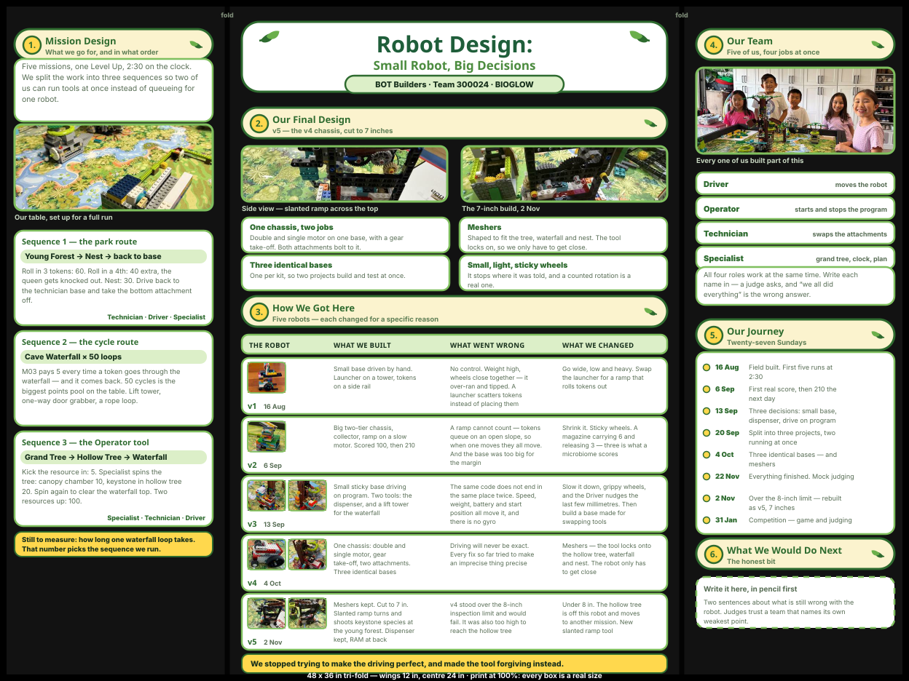
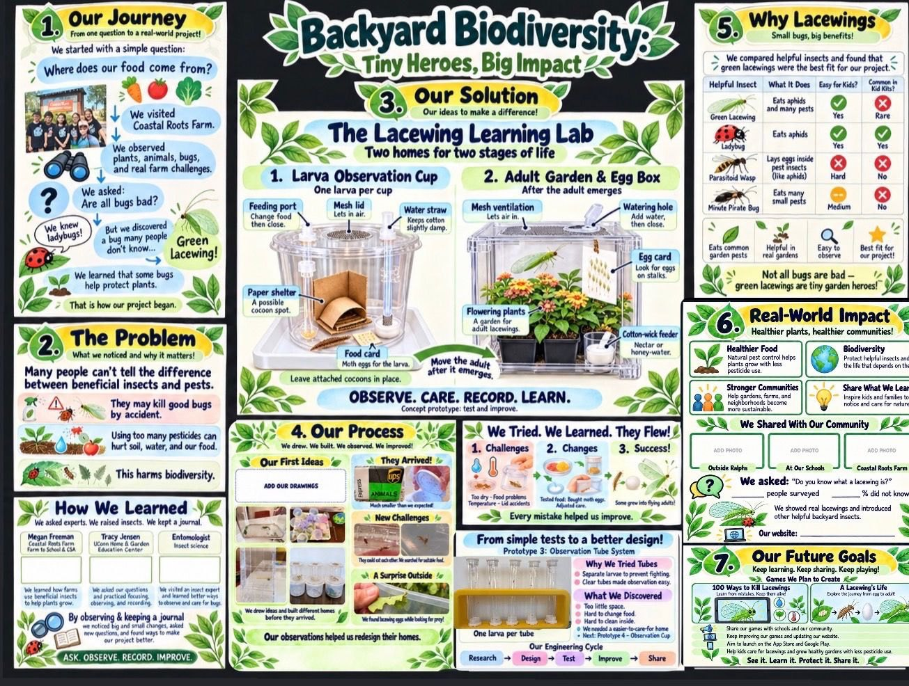
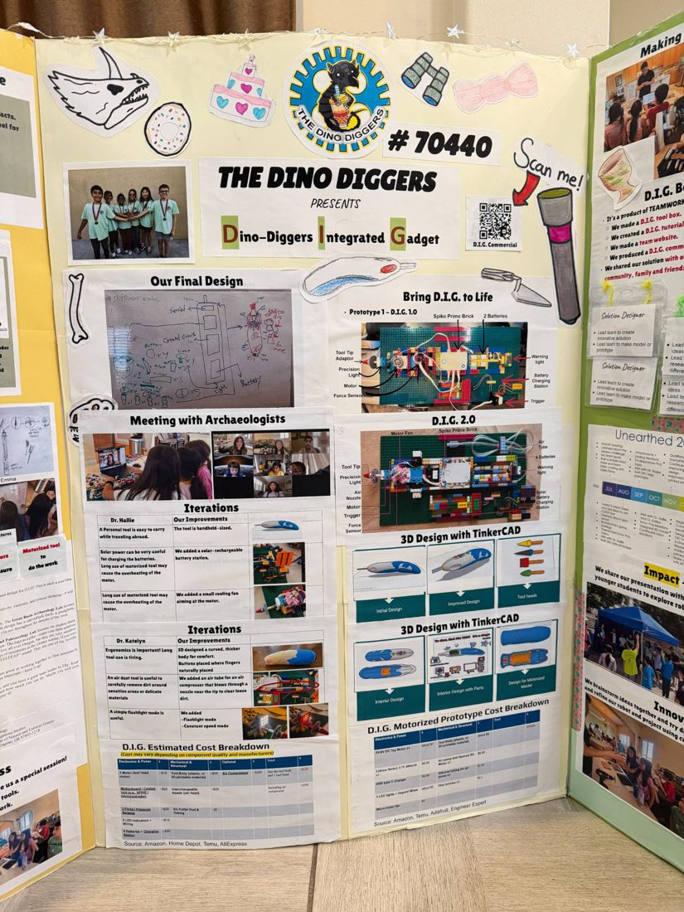
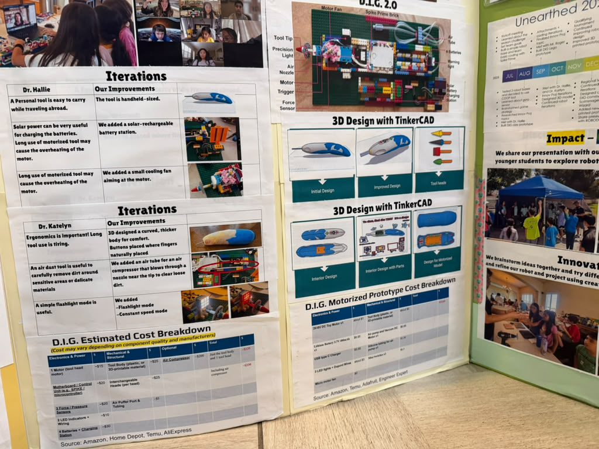

# The Robot Design board

**Summary**: The plan for the Robot Design tri-fold — what goes in each panel, which of our photographs fills each slot, and what still has to be measured before it can be printed. It is dressed to match our own Innovation Project board, and borrows its structure from the Dino Diggers board (team 70440).

**Sources**: raw/source-docs/robot-design-2026-10/ (nine photographs, October 2026 — our robot, our own Innovation Project board, and two of the Dino Diggers board); wiki/match-strategy.md; wiki/driving-base.md; raw/bioglow/fll-future-3-8-judging-rubric.pdf

**Last updated**: 2026-11-08

---

**[Open the layout full size](../assets/robot-design/board-layout.svg)** · regenerate with `python3 scripts/make_board.py`

It is drawn at true print proportions — **48 × 36 inches, wings 12 in, centre 24 in** — so every box on it is a real size. Print at 100% and the boxes are the boxes.

---

## It matches our own board

The Innovation Project board already exists and already works — **Backyard Biodiversity: Tiny Heroes, Big Impact**. Two boards standing next to each other at a tournament should look like they came from the same team, so the Robot Design board borrows its whole visual language:

{: width="620"}

| From our board | On the robot board |
|---|---|
| **A black board**, with everything sitting on it as a card | Same — the panels are black, not cream |
| **Cream banner headings** in dark green display type | Every section heading |
| A **yellow numbered badge** — *1.* *2.* *3.* | Six sections, numbered in reading order |
| A one-line kicker under each heading | Every banner says what its section is *for* |
| White cards outlined in **green** | Every block of text and every photo |
| Yellow for anything still to do | The two callouts |
| Leaf sprigs either side of a heading | Same sprig, drawn in code |

---

## What we took from the Dino Diggers

Their board is an Innovation Project board, not a robot one, but the **shape** of it is what makes it work, and that transfers:

| What they do | Why it works |
|---|---|
| A title block you can read across a room | A judge decides whether to walk over from ten feet away |
| **Two-column iteration tables** — *what we learned* beside *what we changed* | It proves a loop happened. A list of features does not |
| Every expert conversation shown with a photo | *"We met an archaeologist"* is a claim; the screenshot is evidence |
| A costed parts table | Nobody expects it, so it reads as serious |
| A QR code to a video | The board cannot move; the video can |
| Hand-drawn doodles around the edges | It still looks like children made it, which it should |

{: width="420"}
{: width="420"}

**The one thing not to copy: the density.** Theirs is packed to the edges because they had a full season of evidence. Ours has five weeks. A half-full board of real numbers beats a full one of filler.

---

## Panel by panel

### Left wing — mission design and the three sequences

The sequence *is* the argument; the robot is only how it gets delivered. Three sequences, because three is how many can run without queueing for one robot — see [[match-strategy]] and [[season-journal]] Week 11.

| | Route | Why |
|---|---|---|
| **1 · the park route** | Young Forest → Nest → back to base | Roll in **3 tokens = 60**. Roll in a **4th = 40 extra** — the queen gets knocked out. **Nest = 30**. Then drive back to the technician base and take the bottom attachment off. Technician, driver and specialist work together (coach, 8 Nov 2026) |
| **2 · the cycle route** | Cave Waterfall × **50 loops** | M03 pays **5 every pass** — and the token comes back. 50 cycles is the biggest pool on the table. Lift tower, one-way-door grabber, rope loop |
| **3 · the Operator tool** | Grand Tree → Hollow Tree → Cave Waterfall | Deliver the resource token; kicking it in is **5**. The Specialist spins the grand tree toward the hollow tree: resource into the canopy chamber **10**, keystone species into the hollow tree **20**. Do it again for another **20**. The Specialist spins the grand tree once more to move the top blocking the cave waterfall, so the Technician and Driver can get there and the Specialist releases the token. Two resources up top: **100** (coach, 8 Nov 2026) |

**Sequences 1 and 2 are the two sides of the central tension** — park the tokens, or cycle them — and running both is the refusal to choose that the team made in Week 6 when they split the grand tree. Sequence 3 costs the driving base nothing, because it is somebody else's hands.

### Centre — the final design, then how we got there

**Part one: the robot we are taking.** The v5 build — the v4 chassis cut down to 7 inches — shown from the side and at the field, with the four things that make it the one we kept — one chassis with both motor types and a gear take-off, meshers, three identical bases, and small-light-sticky.

**Part two: the five versions**, in four columns — **the robot · what we built · what went wrong · what we changed** — each with its own photographs, and v3, v4 and v5 with two photos each. Dates on every row, and the 210 on v2, so each version reads as an event rather than a label. Full write-up in [[robot-evolution]].

The run data is **not** on the board any more. Tries, worked, seconds and points belong in the kids' notebook and in what they say out loud; a table of empty cells on a tri-fold is worse than no table.

### Right wing — the team and the journey

The four roles with names against them, the team photograph, a dated timeline of twenty-seven Sundays from the field being built to the 31 January competition, and a box for what is still wrong with the robot.

## Before it can be printed

| | Still needed |
|---|---|
| ⬜ | **Timed runs.** Not for the board — for the notebook, and for the sentence *"it worked 11 times in 15"* |
| ⬜ | **Names against the four roles** — unassigned since Week 6 |
| ⬜ | **The waterfall loop time** — one number, and it picks which sequence we run |
| ✅ | **Five real iterations** with dates — done, from [[robot-evolution]] |
| ✅ | **Robot photos** — v1 to v5 are on the board; the final-design photos are now the 7-inch v5 |
| ⬜ | **The slanted ramp** photographed close up and working — the v5 photos show it fitted but not firing. Also confirm the v5 text: the dictation said "RAM at the back" and "a Lego piece box"; this board says *RAM at back* as dictated, probably a ramp |
| ⬜ | **The QR code** — `python3 scripts/make_qr.py "<run video URL>" "Watch a run" --out run` |

> **The numbers are the whole board.** *"Eleven of fifteen tries"* is worth more than any sentence on it. *"It almost always works"* is worth nothing, and a judge has heard it from every team before you.

## Related pages
- [[robot-evolution]]
- [[match-strategy]]
- [[driving-base]]
- [[judging-and-awards]]
- [[bioglow-missions]]

## v5 — what the coach said, and what is assumed

Dictated on 8 Nov 2026 and put on the board as written:

- **Why v5.** v4 was over the 8-inch maximum, so it was cut to **7 inches**. The mesher stays.
- **No hollow tree.** The robot no longer does the hollow tree because it is too high; that job moves to a different mission (matches the earlier decision that the grand tree drops into the hollow tree — see [[match-strategy]]).
- **New tool.** A **slanted ramp** that turns and shoots keystone species into the young forest. The dispenser stays.
- **"A RAM in the back, securing it with two Technic bars and a Lego piece box."** Not clear from the dictation whether this is a ramp, a ram or something else, or what the piece box does. Left as "RAM at the back" until confirmed.

The v5 photographs (1–2 Nov) show the compact black frame with the brown tube lying across the top; they are read, not labelled by the team.

> **Sequence 1, 8 Nov update:** hollow tree dropped from the route (moved to another mission, see v5). "4 tokens = 40 extra because the queen gets knocked out" is as dictated — which mission pays it, and whether it is 40 on top of the 60, still needs checking against the rule sheet.

> **Sequence 3, 8 Nov update:** the dictated figures (5 + 10 + 20, repeated, "total 100 with two up there", plus a stray "20 from the canopy chamber") do not add up cleanly — 2 × (5+10+20) is 70. Check the split against the rule sheet before it goes on a printed board. The old line that the grand tree "never stops the driving base" no longer holds: the Technician and Driver wait on the Specialist to clear the waterfall.
